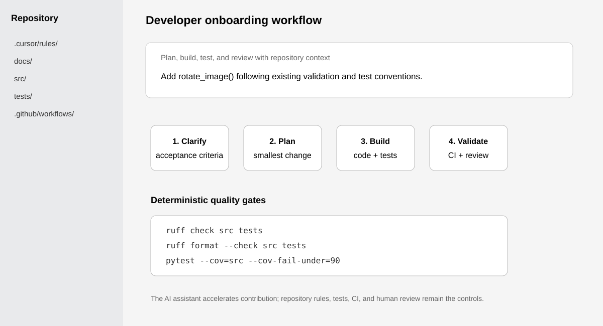

# Developer Onboarding Agent

A governed engineering-onboarding project for helping a new developer move from an ambiguous request to a safe first contribution without bypassing normal engineering controls.

The project uses a small OpenCV-style Python wrapper as the stand-in codebase. **The image-processing functions are not the product; the onboarding workflow is.**

## Workflow preview



## Uses Cursor directly

This repository includes a version-controlled Cursor Project Rule at `.cursor/rules/governed-onboarding.mdc`. Open the repo in Cursor and the rule gives the assistant plan-first, testing, dependency, and completion expectations that a new engineer should follow.

A reproducible walkthrough is in `docs/cursor_demo.md`. The demo asks Cursor to add a new image operation by first inspecting repository conventions, proposing a bounded plan, implementing the change, and validating it through the same deterministic gates as a human contribution.

## Run the engineering gates

```bash
python -m venv .venv
source .venv/bin/activate
pip install -r requirements.txt
ruff check src tests
ruff format --check src tests
pytest --cov=src --cov-report=term-missing --cov-fail-under=90
```

GitHub Actions runs the same quality gates on pushes and pull requests.

## Problem

New engineers often learn repository conventions through scattered documentation, Slack messages, senior engineers, old pull requests, and late review feedback. AI coding tools can make implementation faster, but without repository context and deterministic checks they can also make incorrect contributions faster.

I framed the success metric as **time to first safe PR**, not raw code-generation speed.

## Approach

```text
Ambiguous request
      |
      v
Acceptance criteria / assumptions
      |
      v
Engineering plan
      |
      v
Implementation + tests
      |
      v
QA / edge-case review
      |
      v
CI readiness
      |
      v
Pull request + human review
```

The workflow is designed for multiple roles:

- **PM:** clarify requirements, assumptions, risks, and definition of done
- **Engineer:** plan before editing, follow repository conventions, implement and test
- **QA:** identify missing edge cases and regression risks
- **DevOps:** assess CI/deployment readiness and production gaps

## Engineering controls

AI guidance is not treated as enforcement. Hard controls remain deterministic: linting, formatting, pytest, coverage, dependency policy, pull-request review, CI, and—in a production repository—branch protection.

The implementation contains **11 pytest cases** plus Ruff and coverage gates. All code and documentation in this public repository is self-contained and uses the OpenCV wrapper solely as a deterministic example codebase.

## Why OpenCV?

OpenCV provides deterministic operations with obvious inputs, outputs, and edge cases. That keeps the project focused on onboarding and governance rather than domain complexity. The repository exposes a small internal wrapper around `opencv-python`; it does not reproduce OpenCV.

## What I learned

The most useful pattern was **repo-centric context**: rules, docs, code patterns, tests, and CI together gave the assistant a much better chance of producing a compliant change. Generated changes still had to pass the same deterministic gates as human-written code.

## Why I built it

I wanted to explore how Cursor can accelerate onboarding **without replacing engineering judgment or governance**. It demonstrates the level of hands-on coding fluency I use in customer-facing technical work: understanding a codebase, defining guardrails, debugging setup issues, validating changes, and reasoning about the path from local code to production.

— Anastasia Chueva
